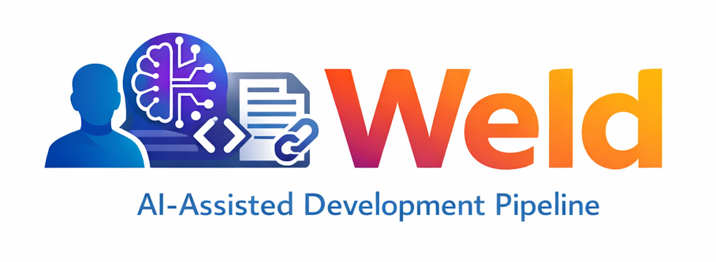

<p align="center">
  
</p>

**Human-in-the-loop coding harness with transcript provenance**

Weld transforms AI-assisted development from ad-hoc prompting into a **structured, auditable workflow**. Instead of context-switching between AI tools and your codebase, weld orchestrates the entire flow: research → plan → implement → review → iterate → commit.

### Why Weld?

- **Structured Workflow**: Turn vague specs into step-by-step plans with acceptance criteria
- **AI Review Loop**: Automatic quality checks with fix prompts until tests pass
- **Full Auditability**: Every AI interaction linked via transcript gists in commits
- **Multi-Provider Support**: Use Claude, Codex, or any AI provider for different tasks
- **Artifact Versioning**: Track plan and research iterations automatically

```
Spec Doc  -->  Research  -->  AI Plan  -->  Implementation Loop  -->  Commit
                                              (AI implement + review)     + transcript
```

## Table of Contents

- [Quickstart](#quickstart)
- [Installation](#installation)
- [Workflow Overview](#workflow-overview)
- [User Guide](#user-guide)
  - [Commands Reference](#commands-reference)
  - [Configuration](#configuration)
  - [Per-Task Model Selection](#per-task-model-selection)
  - [Multi-Category Checks](#multi-category-checks)
  - [Plan Format](#plan-format)
  - [Research Phase](#research-phase)
  - [Discover & Interview](#discover--interview)
  - [Artifact Versioning](#artifact-versioning)
  - [Run Locking](#run-locking)
  - [Debug Logging](#debug-logging)
- [Developer Guide](#developer-guide)
  - [Architecture](#architecture)
  - [Project Structure](#project-structure)
  - [Data Models](#data-models)
  - [Development Commands](#development-commands)
  - [Contributing](#contributing)
- [Exit Codes](#exit-codes)
- [Requirements](#requirements)

---

## Quickstart

Get running in under 5 minutes:

```bash
# 1. Install weld globally
git clone <repo-url> && cd weld-cli
uv tool install .    # or: pipx install .

# 2. Initialize in your project
cd /path/to/your-project
weld init

# 3. Check your environment
weld doctor

# 4. Start a run from a spec file
weld run start --spec specs/my-feature.md

# 5. Copy the research prompt to Claude, save output, then:
weld research import --run <run_id> --file research.md

# 6. Generate plan prompt, copy to Claude, save output, then:
weld plan prompt --run <run_id>
weld plan import --run <run_id> --file plan.md

# 7. Implement step by step
weld step loop --run <run_id> --n 1 --wait

# 8. Commit with transcript provenance
weld commit --run <run_id> -m "Implement step 1" --staged
```

---

## Installation

### Prerequisites

- **Python 3.11+**
- **uv** or **pipx** - For global CLI installation
- **git** - Version control
- **gh** - GitHub CLI (authenticated)
- **claude** - Claude Code CLI (AI provider)
- **codex** - OpenAI Codex CLI (optional)
- **claude-code-transcripts** - For transcript gist generation

### Install Globally (Recommended)

Install weld as a global CLI tool so you can use it in any project:

```bash
# Option 1: Using uv (recommended)
git clone <repo-url> && cd weld-cli
uv tool install .

# Option 2: Using pipx
git clone <repo-url> && cd weld-cli
pipx install .

# Verify installation
weld --help
```

Now `weld` is available system-wide. Use it in any project:

```bash
cd /path/to/your-project
weld init
weld doctor
```

### Install for Development

For contributing to weld itself:

```bash
git clone <repo-url> && cd weld-cli
make setup
eval $(make venv-eval)

# weld is now available in this shell
weld --help
```

### Verify Toolchain

```bash
# Check all required dependencies
weld doctor
```

This validates:
- **Required**: `git`, `gh` (GitHub CLI authenticated)
- **Optional**: `codex`, `claude`, `claude-code-transcripts`

---

## Workflow Overview

Weld implements a deterministic, auditable development pipeline:

```
1. Plan Generation     | AI reads spec, creates step-by-step plan
2. Plan Review         | AI reviews/amends the plan
3. Step Implementation | Human implements with AI-generated prompts
4. Implementation Review | AI reviews diff against acceptance criteria
5. Fix Iteration       | Repeat 3-4 until review passes (or max iterations)
6. Commit              | Create commit with transcript link
```

### Key Concepts

- **Run**: A complete workflow session from spec to commit. Each run gets a unique ID like `20260104-120000-my-feature`.

- **Step**: An atomic unit of implementation from the plan. Each step has acceptance criteria and tests.

- **Iteration**: One cycle through implement-review-fix within a step.

- **Transcript**: A Claude Code session record, published as a GitHub gist and linked in commit messages.

---

## User Guide

### Global Options

All commands support these global options:

| Option | Short | Description |
|--------|-------|-------------|
| `--version` | `-V` | Show version and exit |
| `--verbose` | `-v` | Increase verbosity (`-v` for verbose, `-vv` for debug) |
| `--quiet` | `-q` | Suppress non-error output |
| `--json` | | Output in JSON format for automation (includes schema version) |
| `--no-color` | | Disable colored output |
| `--dry-run` | | Preview effects without applying changes |
| `--debug` | | Enable file-based debug logging to `.weld/debug.log` |

**Flag precedence:** `--quiet` > `--debug` > `--verbose`

- If `--quiet` is set, log level is WARNING regardless of other flags
- If `--debug` is set (and not quiet), log level is DEBUG with file logging
- Otherwise verbosity determines level: 0=INFO, 1=DEBUG, 2+=DEBUG

**JSON output format:**

When using `--json`, output is wrapped with schema version for forward compatibility:
```json
{
  "schema_version": 1,
  "data": { ... }
}
```

---

### Commands Reference

#### `weld init`

Initialize weld in the current git repository.

```bash
weld init
```

Creates:
- `.weld/config.toml` - Configuration file
- `.weld/runs/` - Directory for run artifacts

Exit codes:
- `0` - Success
- `2` - Missing or unauthenticated tool
- `3` - Not a git repository

---

#### `weld run start --spec <path>`

Start a new run from a specification file.

```bash
weld run start --spec specs/feature.md
weld run start --spec specs/feature.md --name my-feature  # Custom run ID slug
weld run start --spec specs/feature.md --skip-research    # Skip research phase
```

Options:
- `--spec`, `-s` - Path to spec file (required)
- `--name`, `-n` - Custom slug for run ID
- `--skip-research` - Skip research phase, generate plan directly

Creates:
- `.weld/runs/<run_id>/meta.json` - Run metadata
- `.weld/runs/<run_id>/inputs/spec.ref.json` - Spec file reference
- `.weld/runs/<run_id>/research/prompt.md` - Research prompt (default)
- `.weld/runs/<run_id>/plan/plan.prompt.md` - Plan prompt (with `--skip-research`)

By default, weld uses a research-first workflow. Use `--skip-research` for direct planning.

---

#### `weld run abandon --run <id>`

Mark a run as abandoned.

```bash
weld run abandon --run 20260104-120000-feature
weld run abandon --run 20260104-120000-feature --force  # Skip confirmation
```

Options:
- `--force`, `-f` - Skip confirmation prompt

---

#### `weld run continue --run <id>`

Continue a paused run from where it left off.

```bash
weld run continue --run 20260104-120000-feature
```

Shows the current status and suggests the next action.

---

#### `weld plan prompt --run <id>`

Generate the plan prompt from spec and research.

```bash
weld plan prompt --run 20260104-120000-feature
```

Outputs the plan generation prompt for copy/paste to Claude. Requires research to be imported first (unless `--skip-research` was used during run start).

---

#### `weld plan import --run <id> --file <path>`

Import an AI-generated plan.

```bash
weld plan import --run 20260104-120000-feature --file plan.md
```

Creates:
- `plan/output.md` - Verbatim AI output
- `plan/plan.raw.md` - Normalized plan

Parses steps using strict format first (`## Step N: Title`), falling back to lenient format (`N. Title`).

---

#### `weld plan review --run <id> [--apply] [--quiet]`

Review the plan with the configured AI provider.

```bash
weld plan review --run 20260104-120000-feature --apply
```

Options:
- `--apply` - Extract and save the revised plan to `plan/plan.final.md`
- `--quiet`, `-q` - Suppress streaming output (for scripts/CI)

The reviewer outputs:
- `## Findings` - Issues and improvements
- `## Revised Plan` - Complete updated plan
- `## Risk Notes` - Implementation risks

---

#### `weld step select --run <id> --n <int>`

Select a step from the plan for implementation.

```bash
weld step select --run 20260104-120000-feature --n 1
```

Creates:
- `steps/01-<slug>/step.json` - Step metadata
- `steps/01-<slug>/prompt/impl.prompt.md` - Implementation prompt

---

#### `weld step loop --run <id> --n <int> [--wait] [--max <int>] [--quiet]`

Run the implement-review-fix loop for a step.

```bash
weld step loop --run 20260104-120000-feature --n 1 --wait
```

Options:
- `--wait`, `-w` - Pause for user input between iterations
- `--max`, `-m` - Override max iterations (default from config)
- `--quiet`, `-q` - Suppress streaming output (for scripts/CI)

Each iteration:
1. Captures git diff
2. Runs checks command
3. AI reviews implementation
4. If issues found, generates fix prompt
5. Repeats until pass or max iterations

Exit codes:
- `0` - Step passed
- `10` - Max iterations reached

---

#### `weld step snapshot --run <id> --n <int> [--iter <int>]`

Manually capture diff and checks for an iteration.

```bash
weld step snapshot --run 20260104-120000-feature --n 1 --iter 2
```

---

#### `weld step review --run <id> --n <int> [--iter <int>] [--quiet]`

Manually run AI review on a step iteration.

```bash
weld step review --run 20260104-120000-feature --n 1 --iter 1
```

Options:
- `--quiet`, `-q` - Suppress streaming output (for scripts/CI)

---

#### `weld step fix-prompt --run <id> --n <int> --iter <int>`

Generate a fix prompt for the next iteration.

```bash
weld step fix-prompt --run 20260104-120000-feature --n 1 --iter 1
```

---

#### `weld step skip --run <id> --step <name>`

Mark a step as skipped.

```bash
weld step skip --run 20260104-120000-feature --step 01-setup --reason "Already implemented"
```

Options:
- `--reason` - Required explanation for why the step is being skipped

---

#### `weld transcript gist --run <id>`

Generate a transcript gist for the run.

```bash
weld transcript gist --run 20260104-120000-feature
```

---

#### `weld commit --run <id> -m "<message>" [--all] [--staged]`

Create a commit with transcript trailer.

```bash
weld commit --run 20260104-120000-feature -m "Implement user auth" --staged
weld commit --run 20260104-120000-feature -m "Implement user auth" --all
```

Options:
- `--staged` (default) - Commit only staged changes
- `--all`, `-a` - Stage all changes before committing

The commit message includes trailers:
```
Implement user auth

Claude-Transcript: https://gist.github.com/...
Weld-Run: .weld/runs/20260104-120000-feature
```

Exit codes:
- `0` - Committed
- `20` - No changes to commit
- `21` - Transcript generation failed
- `22` - Git commit failed

---

#### `weld list`

List all runs.

```bash
weld list
```

---

#### `weld status [--run <id>]`

Show current run status and next action.

```bash
weld status                                    # Most recent run
weld status --run 20260104-120000-feature      # Specific run
```

Displays:
- Run ID, branch, creation time
- Current phase (research, planning, implementation)
- Suggested next command

---

#### `weld next`

Show and suggest the next action for the current run.

```bash
weld next
```

Shortcut that finds the most recent non-abandoned run and shows its status.

---

#### `weld doctor`

Check environment and dependencies.

```bash
weld doctor
```

Validates:
- **Required tools**: git, gh (GitHub CLI)
- **Optional tools**: codex, claude, claude-code-transcripts

Exit codes:
- `0` - All required dependencies available
- `2` - Required dependencies missing

---

#### `weld discover --output <path> [--quiet]`

Analyze codebase and generate architecture documentation prompt.

```bash
weld discover --output docs/architecture.md
weld discover --output docs/architecture.md --focus "authentication system"
```

Options:
- `--output`, `-o` - Path to write discover output (required)
- `--focus`, `-f` - Specific areas to focus on
- `--quiet`, `-q` - Suppress streaming output (for scripts/CI)

Creates `.weld/discover/<discover_id>/prompt.md` for AI analysis.

---

#### `weld discover show --id <discover_id>`

Show discover prompt content.

```bash
weld discover show --id 20260104-120000-discover
```

---

#### `weld discover list`

List all discover artifacts.

```bash
weld discover list
```

---

#### `weld interview <file>`

Interactively refine a specification through Q&A.

```bash
weld interview specs/feature.md
weld interview specs/feature.md --focus "edge cases"
```

Options:
- `--focus`, `-f` - Topic to focus questions on

Outputs a prompt for Claude Code to conduct the interview and rewrite the spec.

---

#### `weld research prompt --run <id>`

Display the research prompt for a run.

```bash
weld research prompt --run 20260104-120000-feature
```

---

#### `weld research import --run <id> --file <path>`

Import AI-generated research document.

```bash
weld research import --run 20260104-120000-feature --file research.md
```

Creates version snapshot if research already exists.

---

#### `weld research show --run <id>`

Display the current research document.

```bash
weld research show --run 20260104-120000-feature
```

---

### Configuration

Configuration lives in `.weld/config.toml`:

```toml
[project]
name = "your-project"

[checks]
# Multi-category checks (preferred)
lint = "ruff check ."
test = "pytest tests/ -q"
typecheck = "pyright"
order = ["lint", "typecheck", "test"]  # Execution order

# Legacy single command (deprecated, for backward compatibility)
# command = "pytest && ruff check"

[codex]
exec = "codex"           # Codex executable path
sandbox = "read-only"    # Sandbox mode
model = "o3"             # Default model (optional)

[claude]
exec = "claude"          # Claude CLI path
model = "claude-3-opus"  # Default model (optional)

[claude.transcripts]
exec = "claude-code-transcripts"
visibility = "secret"    # or "public"

[git]
commit_trailer_key = "Claude-Transcript"
include_run_trailer = true

[loop]
max_iterations = 5
fail_on_blockers_only = true  # Pass if no blockers (ignore major/minor)

# Per-task model selection (see next section)
[task_models]
discover = { provider = "claude" }
interview = { provider = "claude" }
research = { provider = "claude" }
research_review = { provider = "codex" }
plan_generation = { provider = "claude" }
plan_review = { provider = "codex" }
implementation = { provider = "claude" }
implementation_review = { provider = "codex" }
fix_generation = { provider = "claude" }
```

---

### Per-Task Model Selection

Weld supports configuring different AI providers for each task type. Both Claude and Codex can be used interchangeably for any task.

| Task | Description |
|------|-------------|
| `discover` | Codebase discovery for brownfield projects |
| `interview` | User interview for requirements gathering |
| `research` | Deep research on implementation approach |
| `research_review` | Review research findings |
| `plan_generation` | Create implementation plan from spec |
| `plan_review` | Review and improve the plan |
| `implementation` | Generate implementation prompts |
| `implementation_review` | Review diff against acceptance criteria |
| `fix_generation` | Generate fix prompts for issues |

#### Configuration Examples

**Use Claude for everything:**
```toml
[task_models]
discover = { provider = "claude" }
interview = { provider = "claude" }
research = { provider = "claude" }
research_review = { provider = "claude" }
plan_generation = { provider = "claude", model = "claude-3-opus" }
plan_review = { provider = "claude", model = "claude-3-opus" }
implementation = { provider = "claude" }
implementation_review = { provider = "claude" }
fix_generation = { provider = "claude" }
```

**Use specific models per task:**
```toml
[task_models]
discover = { provider = "claude" }
interview = { provider = "claude" }
research = { provider = "claude", model = "claude-3-opus" }
research_review = { provider = "codex", model = "o3" }
plan_generation = { provider = "claude", model = "claude-3-opus" }
plan_review = { provider = "codex", model = "o3" }
implementation = { provider = "claude", model = "claude-3-sonnet" }
implementation_review = { provider = "openai", model = "gpt-4o" }
fix_generation = { provider = "claude" }
```

**Override executable path:**
```toml
[task_models]
plan_review = { provider = "codex", exec = "/custom/path/codex" }
```

#### Priority Order

1. Task-specific `model` field
2. Provider default (from `[codex]` or `[claude]` sections)
3. Tool default

---

### Plan Format

Weld expects plans in a structured markdown format:

#### Strict Format (Recommended)

```markdown
## Step 1: Create config module

### Goal
Set up configuration handling with TOML support.

### Changes
- Create `src/config.py`
- Add `tomli-w` dependency

### Acceptance criteria
- [ ] Config loads from TOML file
- [ ] Default values work when no config exists
- [ ] Invalid TOML raises clear error

### Tests
- pytest tests/test_config.py
- python -c "from myapp.config import load_config; print('OK')"

## Step 2: Build CLI
...
```

#### Lenient Format (Fallback)

If strict format isn't found, weld falls back to:

```markdown
1. Create config module
   Set up configuration handling.

2. Build CLI
   Create the CLI entry point.
```

---

### Multi-Category Checks

Weld supports running checks in multiple categories with configurable execution order.

#### Configuration

```toml
[checks]
lint = "ruff check ."
test = "pytest tests/ -q"
typecheck = "pyright"
order = ["lint", "typecheck", "test"]
```

#### Behavior

- **Fail-fast mode** (default in loop): Stops at first failure to save time
- **Full-run mode** (for review context): Runs all categories even after failure
- Per-category output files stored in `iter/<N>/checks/<category>.txt`
- Summary stored in `iter/<N>/checks.summary.json`

#### Legacy Mode

Single-command mode is deprecated but still supported:

```toml
[checks]
command = "pytest && ruff check"  # Deprecated
```

If both `command` and category fields are set, category mode takes precedence.

---

### Research Phase

The research phase is enabled by default and provides deeper analysis before planning.

#### Workflow

```
1. weld run start --spec feature.md         # Creates research/prompt.md
2. Copy prompt to Claude, save output
3. weld research import --run <id> --file research.md
4. weld plan prompt --run <id>              # Generate plan prompt
5. weld plan import ...                     # Plan can now reference research
```

#### Skipping Research

For simpler tasks or when research is unnecessary:

```bash
weld run start --spec feature.md --skip-research
```

This generates the plan prompt directly, skipping the research phase.

---

### Discover & Interview

For brownfield projects, weld provides discovery and interview workflows.

#### Discover Workflow

Use `weld discover` to analyze an existing codebase:

```bash
weld discover --output docs/architecture.md --focus "authentication"
```

The discover prompt guides AI to produce:
- High-level architecture overview
- Directory structure analysis
- Key file references (file:line format)
- Integration points and testing patterns

#### Interview Workflow

Use `weld interview` to refine specifications through Q&A:

```bash
weld interview specs/feature.md --focus "edge cases"
```

The command outputs a prompt designed for use with Claude Code. The AI will:
1. Ask in-depth questions using the `AskUserQuestion` tool
2. Cover implementation details, UI/UX, edge cases, tradeoffs, and more
3. Rewrite the specification in place when the interview is complete

---

### Artifact Versioning

Weld automatically maintains version history for research and plan artifacts.

#### How It Works

- Up to **5 versions** retained per artifact (configurable via `MAX_VERSIONS`)
- Each version stored in `history/v<N>/` with `content.md` and `meta.json`
- New versions created automatically on import or review
- Old versions pruned automatically when limit exceeded

#### Version Metadata

Each version tracks:
- `version` - Version number
- `created_at` - When created
- `trigger_reason` - Why created (import, review, regenerate)
- `review_id` - Optional reference to review that triggered new version
- `superseded_at` - When replaced by newer version

#### Directory Structure

```
.weld/runs/<run_id>/research/
├── research.md              # Current version
├── prompt.md
└── history/
    ├── v1/
    │   ├── content.md
    │   └── meta.json
    └── v2/
        ├── content.md
        └── meta.json
```

---

### Run Locking

Weld uses PID-based file locking to prevent concurrent modifications.

#### How It Works

- Lock file created at `.weld/active.lock`
- Contains process ID, run ID, command, and timestamps
- Automatically released when command completes
- Stale locks detected and cleared (dead PID or timeout exceeded)

#### Lock File Format

```json
{
  "pid": 12345,
  "run_id": "20260104-120000-feature",
  "command": "step loop",
  "started_at": "2026-01-04T12:00:00",
  "last_heartbeat": "2026-01-04T12:05:00"
}
```

#### Stale Lock Detection

Locks are considered stale if:
- The owning process (PID) is no longer running
- The heartbeat is older than 1 hour (configurable)

Stale locks are automatically cleared on the next command.

---

### Debug Logging

Enable file-based debug logging for troubleshooting.

#### Usage

```bash
weld --debug status
weld --debug step loop --run <id>
```

#### Log File

- Location: `.weld/debug.log`
- Format: Timestamped entries with module names
- Rotation: 10MB max size, 3 backup files retained

#### Log Format

```
2026-01-04 12:00:00 - weld.core.loop - DEBUG - Starting iteration 1
2026-01-04 12:00:01 - weld.services.checks - DEBUG - Running lint check
```

---

## Developer Guide

### Architecture

Weld follows a layered architecture separating CLI, business logic, and external services:

```
weld/
├── cli.py              # Typer app entry point
├── config.py           # Configuration management
├── constants.py        # Timeouts and other constants
├── validation.py       # Input validation utilities
├── logging.py          # Logging configuration (with file-based debug)
├── output.py           # Console output formatting
│
├── commands/           # CLI command modules
│   ├── init.py         # weld init command
│   ├── run.py          # weld run/abandon/continue commands
│   ├── plan.py         # weld plan import/review commands
│   ├── step.py         # weld step select/loop/snapshot/review/skip commands
│   ├── commit.py       # weld commit command
│   ├── research.py     # weld research prompt/import/show commands
│   ├── discover.py     # weld discover command
│   ├── interview.py    # weld interview command
│   ├── status.py       # weld status command
│   ├── doctor.py       # weld doctor command
│   └── next.py         # weld next command
│
├── core/               # Business logic layer
│   ├── run_manager.py  # Run lifecycle management
│   ├── plan_parser.py  # Plan parsing and prompt generation
│   ├── step_processor.py # Step management and prompts
│   ├── loop.py         # Implement-review-fix loop
│   ├── review_engine.py # AI review orchestration
│   ├── commit_handler.py # Commit with transcript trailers
│   ├── research_processor.py # Research phase handling
│   ├── discover_engine.py # Codebase discovery
│   ├── interview_engine.py # Interactive specification refinement
│   ├── artifact_versioning.py # Version history management
│   └── lock_manager.py # Run locking for concurrency control
│
├── services/           # External service integrations
│   ├── git.py          # Git operations wrapper
│   ├── diff.py         # Diff capture utilities
│   ├── checks.py       # Multi-category checks runner
│   ├── claude.py       # Claude CLI integration
│   ├── codex.py        # Codex CLI integration
│   ├── transcripts.py  # Transcript gist generation
│   └── filesystem.py   # File system operations
│
└── models/             # Pydantic data models
    ├── meta.py         # Run metadata (with version tracking)
    ├── step.py         # Step model
    ├── issues.py       # Review issues
    ├── status.py       # Iteration status (with ChecksSummary)
    ├── lock.py         # Lock model for concurrency
    ├── discover.py     # Discover metadata
    ├── version_info.py # Version tracking models
    └── timing.py       # Per-phase performance tracking
```

### Project Structure

```
weld-cli/
├── pyproject.toml      # Package configuration
├── Makefile            # Build automation
├── src/
│   └── weld/           # Main package (see Architecture)
├── tests/              # Test suite
│   ├── conftest.py     # Pytest fixtures
│   ├── e2e_test.sh     # End-to-end shell tests
│   ├── test_artifact_versioning.py
│   ├── test_checks.py
│   ├── test_claude.py
│   ├── test_cli.py
│   ├── test_codex.py
│   ├── test_config.py
│   ├── test_diff.py
│   ├── test_filesystem.py
│   ├── test_git.py
│   ├── test_integration.py
│   ├── test_lock_manager.py
│   ├── test_models.py
│   ├── test_output.py
│   ├── test_plan.py
│   ├── test_research.py
│   ├── test_review_engine.py
│   ├── test_run.py
│   ├── test_step_processor.py
│   ├── test_transcripts.py
│   └── test_validation.py
└── .weld/              # Created per-project
    ├── config.toml
    ├── active.lock       # Run lock file (when active)
    ├── debug.log         # Debug log (with --debug)
    ├── discover/         # Discover artifacts
    │   └── <discover_id>/
    │       └── prompt.md
    └── runs/
        └── <run_id>/
            ├── meta.json
            ├── inputs/
            │   └── spec.ref.json
            ├── research/           # Research phase (default)
            │   ├── prompt.md
            │   ├── research.md
            │   └── history/        # Version history
            │       └── v<N>/
            │           ├── content.md
            │           └── meta.json
            ├── plan/
            │   ├── plan.prompt.md
            │   ├── output.md
            │   ├── plan.md         # Current plan
            │   ├── review.prompt.md
            │   ├── review.output.md
            │   └── history/        # Version history
            │       └── v<N>/...
            ├── steps/
            │   └── 01-<slug>/
            │       ├── step.json
            │       ├── skipped       # If step was skipped
            │       ├── completed     # If step completed
            │       ├── prompt/
            │       │   ├── impl.prompt.md
            │       │   └── fix.iter02.md
            │       └── iter/
            │           ├── 01/
            │           │   ├── diff.patch
            │           │   ├── checks/           # Per-category checks
            │           │   │   ├── lint.txt
            │           │   │   ├── test.txt
            │           │   │   └── typecheck.txt
            │           │   ├── checks.summary.json
            │           │   ├── review.md
            │           │   ├── issues.json
            │           │   └── status.json
            │           └── 02/...
            ├── commit/
            │   ├── message.txt
            │   └── transcript.json
            └── summary.md
```

### Data Models

#### Meta
Run metadata: timestamps, repo info, config hash, tool versions, and version tracking.

```python
class Meta(BaseModel):
    run_id: str
    created_at: datetime
    updated_at: datetime
    repo_root: Path
    branch: str
    head_sha: str
    config_hash: str
    tool_versions: dict[str, str]
    plan_parse_warnings: list[str]
    # Version tracking
    research_version: int = 1
    plan_version: int = 1
    # Staleness tracking
    stale_artifacts: list[str]
    stale_overrides: list[StaleOverride]
    # Run state
    last_used_at: datetime | None
    command_history: list[CommandEvent]
    abandoned: bool = False
    abandoned_at: datetime | None
```

#### SpecRef
Reference to the input specification file.

```python
class SpecRef(BaseModel):
    absolute_path: Path
    sha256: str
    size_bytes: int
    git_blob_id: str | None
```

#### Step
Parsed plan step with acceptance criteria.

```python
class Step(BaseModel):
    n: int
    title: str
    slug: str
    body_md: str
    acceptance_criteria: list[str]
    tests: list[str]
```

#### Issues
Review result from AI provider.

```python
class Issue(BaseModel):
    severity: Literal["blocker", "major", "minor"]
    file: str
    hint: str
    maps_to: str | None  # e.g., "AC #2"

class Issues(BaseModel):
    pass_: bool = Field(alias="pass")
    issues: list[Issue]
```

#### Status
Iteration status with counts, checks summary, and timestamp.

```python
class CategoryResult(BaseModel):
    category: str
    exit_code: int
    passed: bool
    output: str

class ChecksSummary(BaseModel):
    categories: dict[str, CategoryResult]
    first_failure: str | None
    all_passed: bool

class Status(BaseModel):
    pass_: bool = Field(alias="pass")
    issue_count: int
    blocker_count: int
    major_count: int
    minor_count: int
    checks_summary: ChecksSummary | None
    checks_exit_code: int  # Deprecated: use checks_summary instead
    diff_nonempty: bool
    timestamp: datetime
```

#### Lock
Active run lock for concurrency control.

```python
class Lock(BaseModel):
    pid: int
    run_id: str
    command: str
    started_at: datetime
    last_heartbeat: datetime
```

#### VersionInfo
Artifact version metadata.

```python
class VersionInfo(BaseModel):
    version: int
    created_at: datetime
    review_id: str | None
    trigger_reason: str | None
    superseded_at: datetime | None
```

#### Timing
Per-phase performance tracking.

```python
class Timing(BaseModel):
    ai_invocation_ms: int = 0
    checks_ms: int = 0
    review_ms: int = 0
    total_ms: int = 0
```

### Development Commands

All common tasks are available via `make`. Run `make help` for the full list.

#### Quick Reference

```bash
# Essential commands for development
make setup          # First-time setup (install + hooks)
make check          # Run all quality checks
make test           # Run tests
make ci             # Full CI pipeline
```

#### Setup

```bash
make setup          # Complete dev setup (install deps + pre-commit hooks)
make install        # Install dependencies only
make install-dev    # Install dev dependencies
make venv           # Show command to activate virtual environment
eval $(make venv-eval)  # Activate venv in one command
```

#### Running Weld

```bash
make run ARGS="--help"           # Run weld CLI with arguments
make run ARGS="list"             # List all runs
make run ARGS="doctor"           # Check dependencies
make shell                       # Start Python shell with weld imported
```

#### Testing

```bash
make test           # Run all tests
make test-unit      # Run unit tests only (@pytest.mark.unit)
make test-cli       # Run CLI integration tests (@pytest.mark.cli)
make test-slow      # Run slow tests (@pytest.mark.slow)
make test-cov       # Run tests with coverage report
make test-cov-html  # Run tests with HTML coverage report
make test-e2e       # Run end-to-end tests
make test-all       # Run all tests (unit + e2e)
make watch          # Run tests in watch mode (requires pytest-watch)
```

#### Code Quality

```bash
make lint           # Run ruff linter
make lint-fix       # Run linter with auto-fix
make format         # Format code with ruff
make format-check   # Check formatting without changes
make typecheck      # Run pyright type checker
make check          # Run all quality checks (lint + format + types)
make pre-commit     # Run all pre-commit hooks
make quality        # Alias for full quality suite
```

#### Security

```bash
make audit          # Check dependencies for vulnerabilities
make secrets        # Scan for secrets in codebase
make security       # Run all security checks
```

#### Build & Release

```bash
make build          # Build the package
make version        # Show current version
make bump PART=patch  # Bump version (patch|minor|major)
make bump-patch     # Shortcut: 0.1.0 -> 0.1.1
make bump-minor     # Shortcut: 0.1.0 -> 0.2.0
make bump-major     # Shortcut: 0.1.0 -> 1.0.0
make clean          # Clean build artifacts
make clean-all      # Clean everything including venv
```

#### CI Pipeline

```bash
make ci             # Run full CI pipeline (quality + tests + security)
```

### Contributing

1. **Fork and clone** the repository
2. **Setup environment**: `make setup`
3. **Make changes** with tests
4. **Run checks**: `make ci`
5. **Submit a PR**

---

## Exit Codes

| Code | Meaning |
|------|---------|
| 0 | Success |
| 1 | General error / file not found |
| 2 | Dependency missing / unauthenticated gh |
| 3 | Not a git repository |
| 10 | Max iterations reached |
| 11 | Checks failed (strict mode) |
| 12 | AI provider invocation failed / malformed JSON |
| 20 | No changes to commit |
| 21 | Transcript generation failed |
| 22 | Git commit failed |

---

## Requirements

**For using weld:**
- Python 3.11+
- uv or pipx (for global installation)
- git
- gh (GitHub CLI, authenticated)

**AI providers (at least one):**
- claude (Claude Code CLI)
- codex (OpenAI Codex CLI)

**Optional:**
- claude-code-transcripts (for transcript gist generation)

**For development:**
- make (build automation)
- uv (package manager)

---

## License

See [LICENSE](LICENSE) for details.
